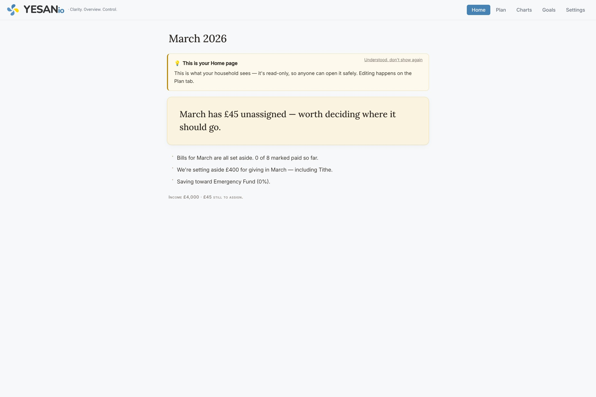
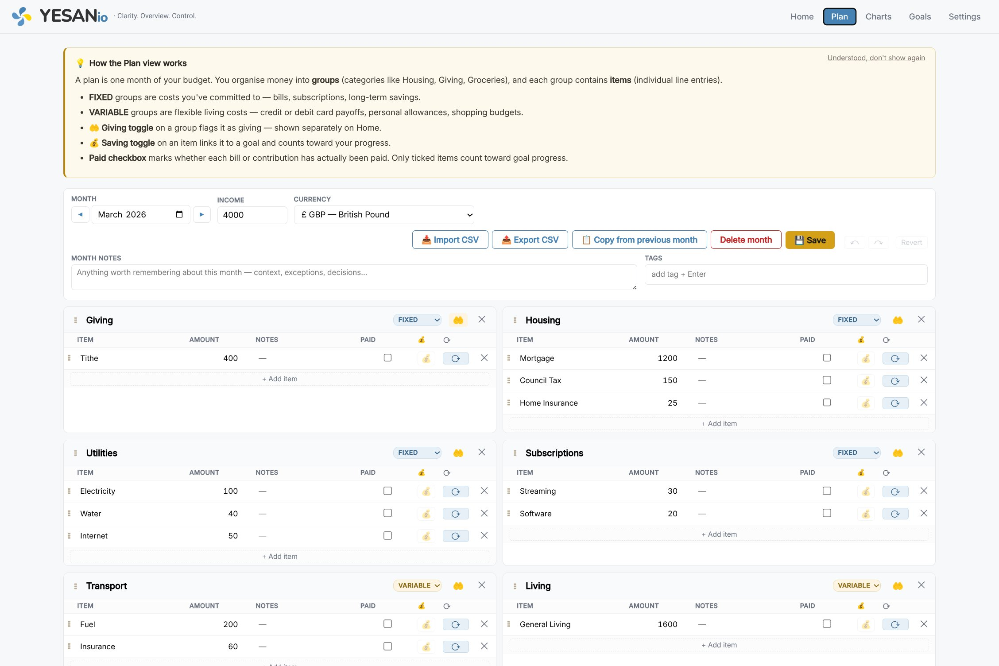

<p align="center">
  
</p>

<h1 align="center">Yesanio</h1>

<p align="center"><em>Clarity. Overview. Control.</em></p>

Yesanio is a self-hosted budgeting tool for households that plan their money together — built around the principle that every pound has a job before the month begins.

Version 2.5.20 · [Changelog](CHANGELOG.md) · MIT licence · © 2026 Johannes Kim (Pistio)

---

## What is Yesanio?

Yesanio is a budgeting tool for households that plan their money together. It's designed around a single principle: **pay yourself first**. Savings, giving, and long-term commitments are set aside at the start of the month — not whatever happens to be left at the end.

Yesanio does **not** track what you spend. It's not a bank-transaction importer or an expense tracker. It's a planning tool: you decide where every pound goes, save the plan, and by the end of the month you've done what you intended to do. How that maps to reality — bank statements, credit card bills, actual receipts — happens outside Yesanio.

This is a deliberate choice. Most budgeting tools fail by making you feel guilty about things you can no longer change. Yesanio's failure mode is the opposite: an incomplete plan, with the fix visible right in front of you.

<p align="center">
  
  <br>
  <em>The Home view — read-only, shared across the household.</em>
</p>

## Who is it for?

- **Households who plan money together.** Yesanio has a read-only Home page designed to be opened by anyone in the family — a partner, an older child — without fear of accidentally editing the plan. The Home page shows the month's status in plain English, what's being set aside for giving, what's being saved toward, and whether the bills are handled.
- **People who want their giving and saving visible.** Giving groups are shown separately on Home, not buried in bills. Goals auto-update as you tick the Paid box on each monthly contribution, and the current and historical progress is always one tab away.
- **Self-hosters.** Yesanio is a three-container Docker stack (FastAPI backend, MariaDB, nginx serving static frontend). It runs on a Raspberry Pi, a home server, or any small VPS. No cloud sign-up, no telemetry, no subscription. Your data stays on your machine.

## Who is it not for?

- People who want automatic transaction tracking from their bank (use YNAB, Monarch, or Actual Budget)
- People who want shared multi-user accounts with separate logins (Yesanio is single-user; the Home page is shared-view, not shared-edit)
- People who want mobile-native apps (the web UI works on phones, but there's no iOS/Android client)

## How it works

### Plans, groups, items

A **plan** is one month's budget. Inside a plan are **groups** — categories like Housing, Giving, Groceries. Inside each group are **items** — individual line entries with a name, amount, optional notes, and a Paid checkbox.

Groups are either `FIXED` (bills, subscriptions, long-term savings) or `VARIABLE` (flexible living costs). The 🤲 toggle on a group marks it as a *giving* group, surfaced separately on the Home page.

<p align="center">
  
  <br>
  <em>The Plan view — where the month gets built, group by group.</em>
</p>

### Saving goals

Each item can be flagged with the 💰 toggle to mark it as a saving contribution. When you save the plan, Yesanio auto-creates a goal matching the item's name, and runs a recompute: every flagged item with its Paid box ticked across all plans contributes its amount to the matching goal's progress.

This means you never edit goal progress directly. You plan the contribution, tick the Paid box when the transfer actually happens, and the goal catches up automatically. Unticked contributions show as "pending" with a warning on the Goals page — the failsafe that prevents the common mistake of flagging a contribution and forgetting to tick it.

Goals support optional date windows: count only contributions from a specific range of months, or leave the window empty to count forever. Useful for yearly goals like "Holiday 2026" that should reset naturally at year boundaries.

### The Home page

The Home page is Yesanio's most important surface. It's read-only and summarises the current month in sentences, not cards:

```
April 2026
HANDLED BY JOHANNES · LAST LOOKED AT TODAY

    April is fully planned. Every pound has a job.

· Bills for April are all set aside. 23 of 27 marked paid so far.
· We're setting aside £1,832 for giving in April — including Tithes + 
  Offering, Mission Offering, Compassion Donation.
· Saving toward the emergency fund (62%) and the family holiday (18%).

INCOME £7,923 · EVERYTHING ASSIGNED A JOB.
```

The design choice is deliberate: this is what your household sees. It should read like a note, not like a dashboard.

### Flexible cash-flow models

Yesanio supports the two common patterns:

- **Credit-card-and-pay-off:** variable spending goes on a credit card during the month, and the statement is paid off as a line item in the *next* month's plan. A "Living" group in April might contain a "Credit card payment" line covering March's variable spending. The saldo comes out to zero by design.
- **Debit-card-allocate-upfront:** variable spending comes directly from a spending account (or debit card), and you allocate the month's spending budget up front as line items in a VARIABLE group. The money is set aside on day one; you draw against it during the month.

Either pattern works. It's about *when* you decide where the money goes, not which card it touches. Yesanio's job is to make the plan explicit before the month begins.

For more on any of this, see [`docs/concepts.md`](docs/concepts.md).

---

## Installing Yesanio

Two install guides are available, depending on your background:

- **[INSTALL.md](docs/INSTALL.md)** — terse, developer-audience install. Assumes Docker familiarity.
- **[INSTALL-FOR-EVERYONE.md](docs/INSTALL-FOR-EVERYONE.md)** — patient, no-jargon walkthrough for non-developers. Covers Windows, macOS, Linux, and Chromebook step by step.

The quick version is below for those who just want the commands.

### Requirements

- Docker and Docker Compose
- Any Linux/macOS machine with ~300MB free for the containers

### First-time setup

```bash
git clone https://github.com/jc-universe87/yesanio.git
cd yesanio
docker compose up -d
```

The backend runs migrations automatically on startup. When logs show `Schema up to date (version 6)`, open `http://localhost:6210` in a browser. A first-run welcome wizard guides you through setting your name, currency, and first plan.

### Ports

- Frontend (nginx): **6210**
- Backend (FastAPI): **6211**
- Database (MariaDB): internal only, not exposed

### Credentials

**Important:** `docker-compose.yml` ships with placeholder database credentials (`yesanio_root_change_me`, `yesanio_app_change_me`). These are self-documenting — change them before deploying anywhere the container might be reachable.

Yesanio is designed for trusted local networks (home server + Tailscale/Cloudflare Tunnel, or localhost-only). It has no authentication built in. If you expose it to the public internet, add authentication at the reverse-proxy layer.

### Backup

```bash
bash backup.sh
```

Writes a timestamped `.sql` dump of the database to `./backups/`. Run this on a schedule via cron, or before any experimental deploy.

### Upgrade

```bash
cd ~/docker-compose/yesanio
git pull
docker compose down
docker compose build --no-cache yesanio-backend
docker compose up -d --force-recreate
```

Migrations run automatically. The frontend is bind-mounted so any `frontend/` changes take effect immediately. The database volume (`yesanio_db_data`) is never touched by an upgrade; your data is safe.

---

## Data and privacy

Yesanio stores all data locally in the container's MariaDB volume. It makes **no outbound network requests**, includes **no analytics or telemetry**, and loads **no third-party scripts or fonts** — all typefaces are self-hosted.

If you self-host Yesanio for your own household, GDPR's household-activity exemption (Article 2(2)(c)) typically applies: you're processing your own data for your own use, and the regulation's commercial obligations don't apply. If you host it as a service for other people, you become a data controller and the usual obligations kick in — that's explicitly out of scope for this project.

---

## Architecture

### Stack

- **Backend**: Python 3.11, FastAPI, mariadb-connector
- **Database**: MariaDB 11
- **Frontend**: vanilla JavaScript, no build step, bind-mounted into nginx:alpine
- **Fonts**: Inter (body), Lora (Home headline), Nunito (wordmark) — all self-hosted, no external CDN

### Schema

```
plans       — one row per month (month, income, currency, notes, tags)
plan_groups — groups per plan (name, kind FIXED/VARIABLE, is_giving)
plan_items  — items per group (name, amount, status, is_saving, recurring)
goals       — savings goals (name, target, current, count_from, count_to)
settings    — key/value preferences (user_name, wizard_completed, etc.)
```

Schema changes are managed through the forward-only migration system in `backend/main.py`. The current schema is version 6.

### Contributing

Yesanio is MIT-licensed and welcomes contributions, particularly:

- Translations (the UI is currently English-only)
- Charts and reporting improvements
- Accessibility fixes
- Documentation

Open an issue before large changes to discuss direction — Yesanio has a deliberate "less is more" design philosophy, and not every feature request is a fit.

---

*"The plans of the diligent lead surely to abundance." — Proverbs 21:5*
